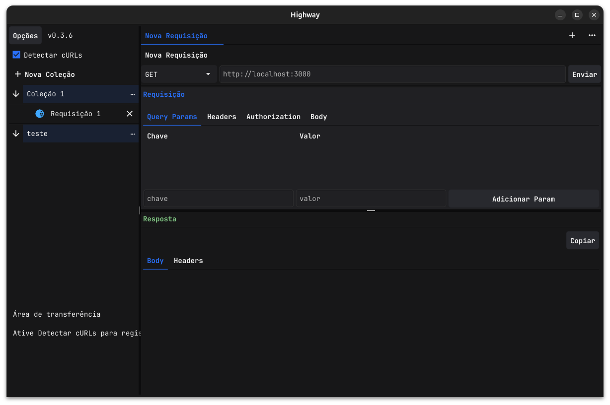

# Highway

A fast, native API client for macOS and Linux. Organize, edit, and run your HTTP requests — locally, privately, no account required.



## Why Highway?

Highway keeps everything on your machine: your collections, requests, and variables live in plain JSON files in your own user directory — no cloud, no account, no telemetry. Paste a `curl` command and it becomes an editable request in one step, with familiar tabs and collections to keep your APIs organized.

## Installation

### macOS

Download the DMG for your architecture (Intel or Apple Silicon) from the [latest release](https://github.com/herrmann13/highway/releases), open it, and drag Highway into **Applications**. On first launch, right-click the app and choose **Open** to confirm you trust the unsigned build.

### Linux

Download the `.deb` package from the [latest release](https://github.com/herrmann13/highway/releases) and install it:

```bash
sudo apt install ./highway_0.1.0-1_amd64.deb
```

This installs the `highway` binary, an application-menu entry, and the app icon. Remove it at any time with `sudo apt remove highway`.

> Prefer to build it yourself? See [Building from source](#building-from-source).

## Features

- Organize requests into collections, with a sidebar tree, tabs, and inline renaming (double-click)
- Build requests with separate tabs for method & URL, query params, headers, body, and authorization
- Use `{{variables}}` anywhere, defined per collection and expanded before sending
- Authenticate with No Auth, Basic, Bearer, API Key, Digest, OAuth 1.0, and OAuth 2.0
- Send requests and read color-coded status, response time, and headers at a glance (up to 50 MB bodies)
- Import `curl` commands directly, via the macOS Services menu, or from clipboard auto-detection
- Check for updates, verified against the published SHA-256 checksum
- Keep everything local as JSON files, with export/import and automatic migration

## Quick start

1. Click **New Collection** to create a collection.
2. Add a request from the collection menu, or import one from `curl` (Options → Import → cURL).
3. Fill in the URL, hit **Send**, and inspect the response.

## Export & import

Use **Export** in the sidebar to save selected collections (with their requests and variables) to a JSON file. Restore them on another machine via Options → **Import → Collections**. Imports are additive and never delete existing data; duplicate names automatically get a suffix like `API (2)`.

## Building from source

Highway is built with Go and [Fyne](https://fyne.io).

### macOS

```bash
make macos
```

The app is created at `dist/Highway.app`. To build a distributable DMG:

```bash
make macos-dmg VERSION=0.1.0
```

### Linux (Ubuntu/Debian x86_64)

```bash
sudo apt install -y build-essential libgl1-mesa-dev xorg-dev libxkbcommon-dev libwayland-dev librsvg2-bin
make deb
```

## Releases

Pushing a `vMAJOR.MINOR.PATCH` tag triggers the GitHub release workflow, which produces macOS DMGs for Intel and Apple Silicon, the `.deb` for Linux, and the `SHA256SUMS` file used by the updater.

## License

Released under the [MIT License](LICENSE).
